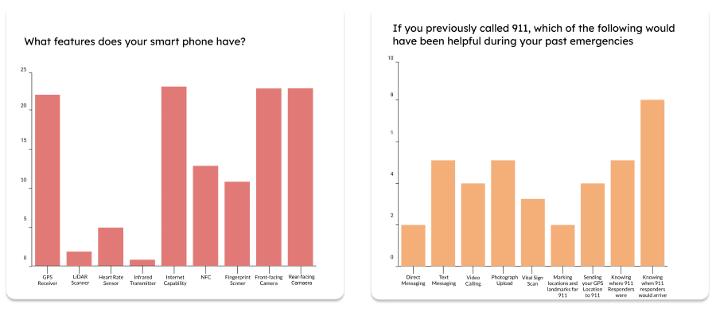

# Background

<iframe width="560" height="315" src="https://www.youtube.com/embed/a_fWpdRpUqk" title="YouTube video player" frameborder="0" allow="accelerometer; autoplay; clipboard-write; encrypted-media; gyroscope; picture-in-picture" allowfullscreen></iframe>

## Planning Process

# User Research

# Visual Designs

# Engineering Process

# Takeaways and Learnings
