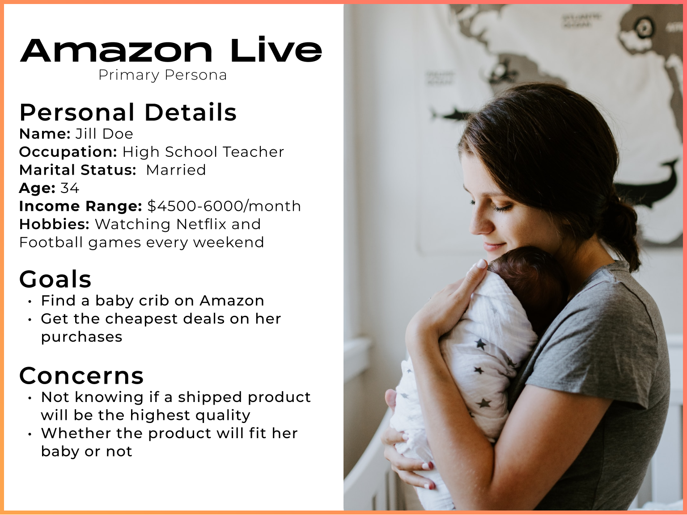

# Background

With one week to completion, this product management case study was a take-home assignment from a tech company. The prompt was to improve an existing product feature, create a mockup, and utilize metrics that you may use as a product manager to validate your improvement. This is an adaption of the slidedeck into a written format. 

### What is Amazon Live?

At certain times of the day Amazon will showcase a livestream of someone selling discounted Amazon items on its homepage.

### Why did I choose Amazon Live?

With a soft spot for watching shopping channels throughout my childhood, Amazon livestreams humanize the online shopping experience through someone advocating for the product. These livestreams allow the user to see how a product works without needing to buy it.

# How can we improve Amazon livestreams?

### How can we define our goals?

Although looking at a company's mission statement and values aren't a specific data point, they are incredibly important to consider. Part of Amazon's mission is to improve the customer experience and help them discover products.

> ###### We aim to be Earth’s most customer centric company. Our mission is to continually raise the bar of the customer experience by using the internet and technology to help consumers find, discover and buy anything, and empower businesses and content creators to maximise their success

### Goals we could pursue are:

1. Maximizing sold products

   * Which item categories lead to higher a higher CTR on livestreams? 
   * What is the sale conversion % of those that click?
2. Improving user experience

   * Can we utilize focus groups and usability testing to improve the experience for users?
   * What are the times on tasks, number of errors, or overall System Usability Score?
3. Maximizing session duration: 

   * On average, how long do users watch a livestream before purchasing a product?
   * How much are the users interacting with the livestream?
4. Maximizing customer acquisition cost

   * How much is Amazon spending on live streams to acquire a sale?
   * How much does it cost to hire a broadcaster relative to the volume of sales?

After evaluating all these goals, I want to maximize sold products because it can go hand-in-hand in improving user experience. While there might be merit for maximizing session duration to increase awareness of products, I want to pursue maximizing sold products instead as a truer indicator of helping users find products they want. 

# Who are we building this for?

### Market Segments

Whenever building a product, we need to understand who we're building it for. Although we tunnel down on one user segment for our solution, it doesn't necessarily mean that it can't benefit the others!

#### Some example market segments:

* College students
* First time mothers
* Gamers
* Home Chefs

I'm going to build my improvement with first time mothers in mind. This will help me picture specific solutions in my head, but, this doesn't mean that my solution can't help college students or gamers too! Next, I'll generate a primary user persona to pinpoint critical wants and pain points.

### Primary User Persona

# Choosing the Improvement

With the wants and paint points in Jill in mind, we can finally create our improvement! 

##### Potential Solutions:

1. Exclusive Deals w/countdown timer

   * Urge the customer that they only have X amount of time for this item
2. Product Card w/more info

   * Users may need info that the showcaser isn't talking about, but don't want to leave the livestream.
3. Instant buy now option

   * If users have enough info about the item already, then why redirect to the item page when you can just add to cart directly
4. Chatbox to ask the showcaser questions

   * Obtain info through direct interaction with the showcaser

| Solution                 | Ease of Implementation | Risk | Value to Customer |
| ------------------------ | ---------------------- | ---- | ----------------- |
| Countdown Timer          | 2/5                    | 2/5  | 3/5               |
| Product Card w/more info | 1/5                    | 1/5  | 4/5               |
| Instant Buy Now          | 1/5                    | 1/5  | 4/5               |
| Live chatbox             | 4/5                    | 5/5  | 3/5               |

I often only try one improvement, but both the product card w/more info and the instant buy now really compliment each other. Since the ease of implementation and risk are both on the lower end while providing a lot of value to the customer, the combination can be developed in parallel and combined. 

More information without going to the item page will help accelerate the user's purchase. The Instant Buy Now button Amazon has opens a modal that allows you to directly checkout as well. Every step a user takes to checking out an item increases the chances that they will take it out of their cart.

### Designing the Improvement

I started out sketching some wireframes so I could get a general idea of laying out the item card. Since this challenge, was in a constrained time frame, I decided to skip to high fidelity prototypes afterwards. 

After sketching, I placed my high fidelity prototypes directly on the Amazon page to see how it would compare to the original. 

 

# Why is our solution better than the original?

Let's go back to our original goal of maximizing sold products. Does our product also help Jill's pain points?

1. 'Buy Now' button decreases friction. Customers don't need to go through an additional 2-3 pages to checkout
2. Additional information addresses questions not being answered by the livestream. If users land a little late on the livestream, there's relevant info on our card

We suggest Jill a baby crib she was already looking for, give a live demonstration with product specs, and show a great deal for her at the end of the day! Before, she had to leave the livestream to the item page to purchase it, meaning that she could bounce to other products.

|      | Old versus Updated Design |
| ---      | ---       |
| New Design |          |
| Old Design     | 

### North Star Metrics

1. Checkout conversion rate: % of users buying item after watching for 1-5 minutes
2. Return % of items bought through our item card: Amount of items returned / Amount of items bought
3. Average livestream watch time

Our north star metric here would have to be checkout conversion rate. This is directly funneled to our goal of maximizing product sales. Although I don't have a direct number how long a user needs to watch before deemed a "livestream viewer", I estimate that it's anywhere between 1-5 minutes minimum. This metric however isn't perfect - if we sell a lot of products, but have a high return %, then we aren't doing a good job for our mission or our goal. We also have additional metrics above and from slide 3 that will aid testing and improvement.

#### Collecting data:

* A/B Testing and Multivariate Testing: If we want to test the "Buy Now" button and the additional information in different combinations, we can utilize a multivariate test. If we want to just a control group against our blanket new solution, we can use an A/B test.
* Usability Testing: Track the user's flow as they navigate Amazon's website. Record time to complete tasks, and if the changes improved user satisfaction through a rating system.

#### Future Considerations

* Information overload: We need to limit the amount of information being displayed. The focus for livestreams is on the showcaser trying to sell you the item, not on the item card.
* Add to cart option: I specifically chose 'Buy Now' over add to cart to make the process frictionless. However, we can look into item return rates to see whether this was actually a good option.
