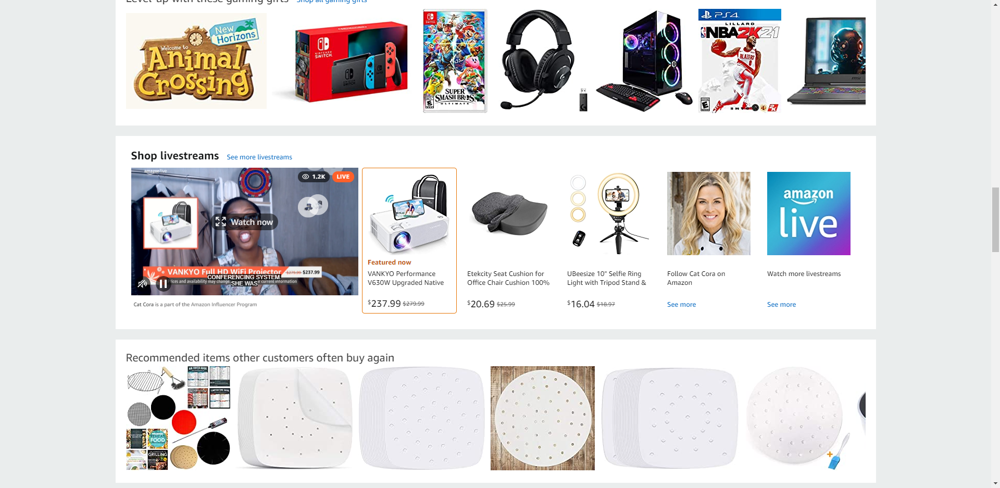
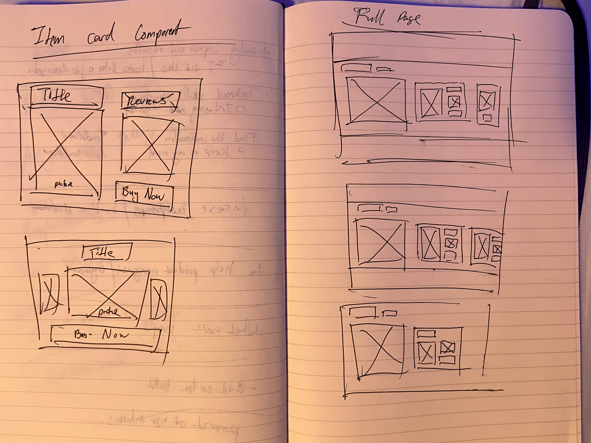
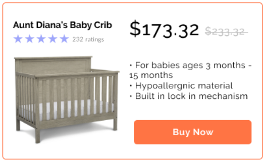
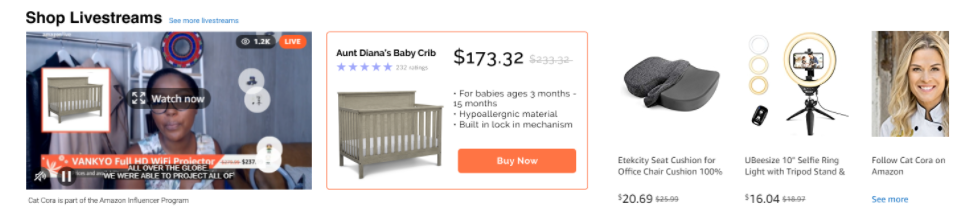

# Background

## What is Amazon Live?

# How can we improve Amazon livestreams?

## How can we measure success?

# Who are we building this for?

## Market Segments

## User Personas

### Information

### Wants and Pain Points

# Choosing the Improvement

| Solution                 | Ease of Implementation | Risk | Value to Customer |
| ------------------------ | ---------------------- | ---- | ----------------- |
| Countdown Timer          | 2/5                    | 2/5  | 3/5               |
| Product Card w/more info | 1/5                    | 1/5  | 4/5               |
| Instant Buy Now          | 1/5                    | 1/5  | 4/5               |
| Live chatbox             | 4/5                    | 5/5  | 3/5               |

## Designing the Improvement

 

# Why is our solution better than the original?

### North Star Metrics

### Testing our Improvement
