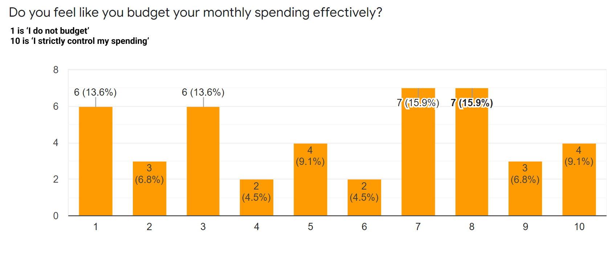
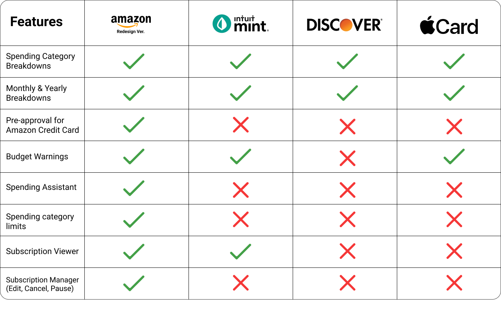
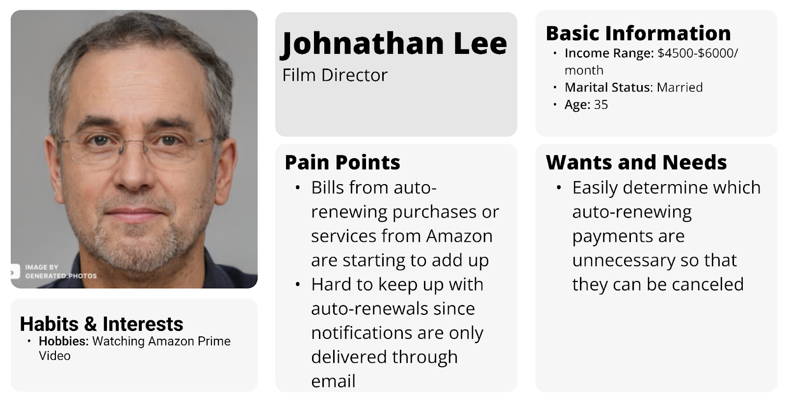
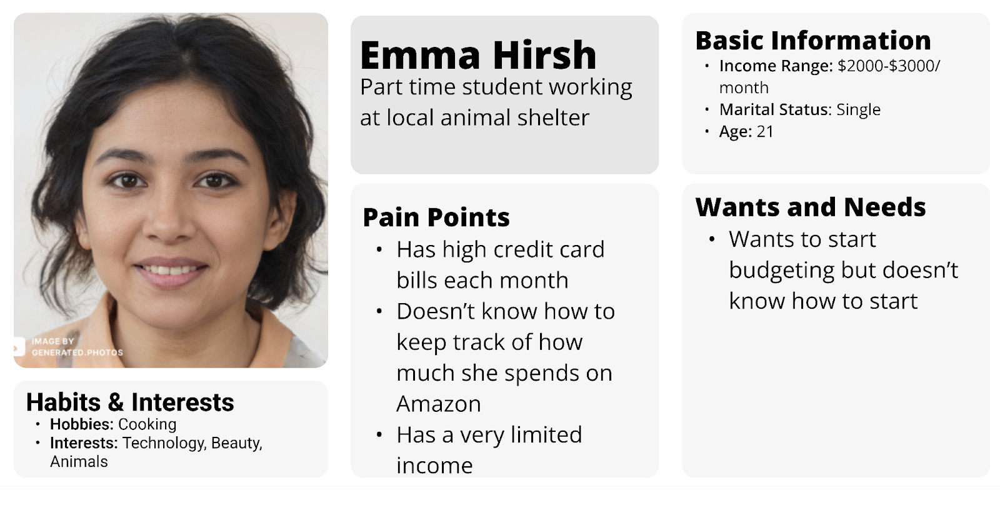
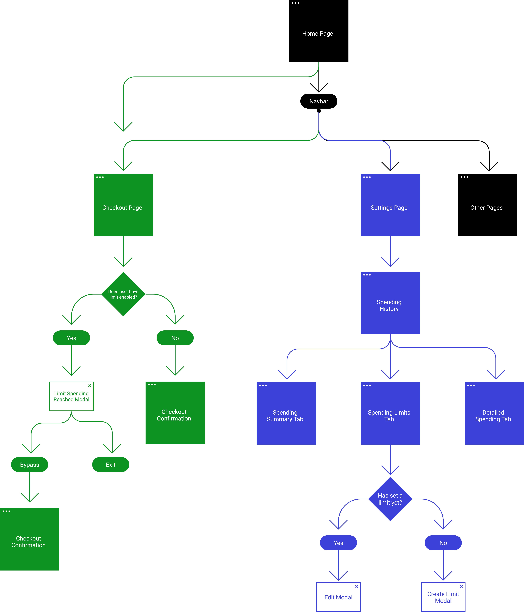
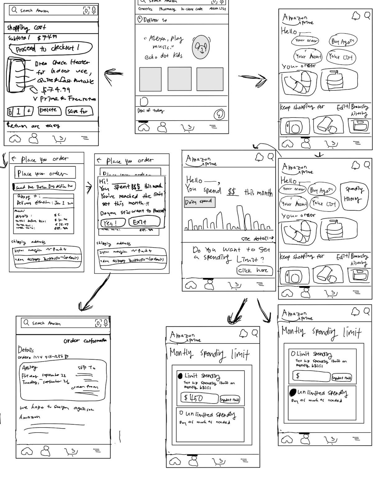
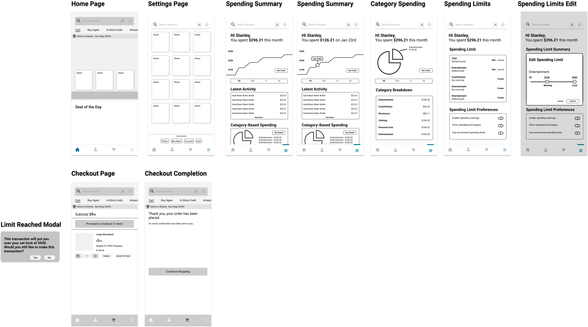
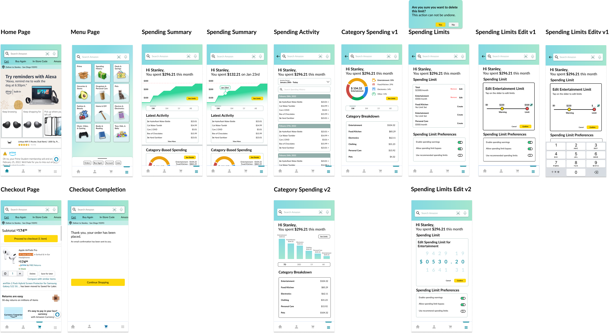
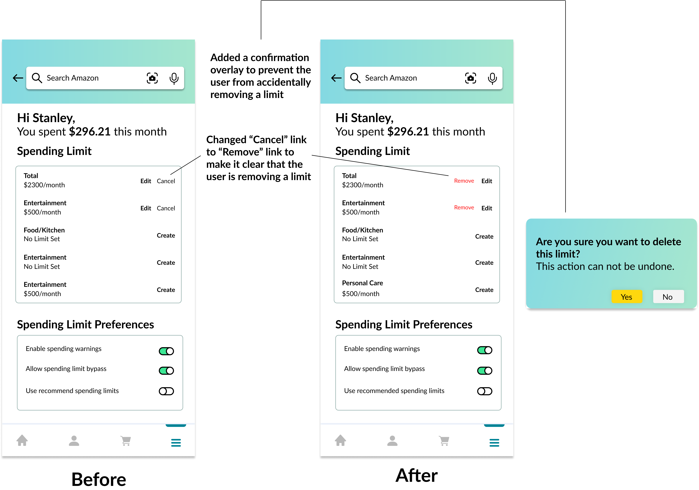

*Created with Jackie Kwok, Taekyu Lee, and Duha Kim*

# The Problem

On Amazon.com, there are over 1.7 million orders every hour. Amazon orders flood warehouses day and night and fuel the consumeristic behaviors of over a hundred million Amazon Prime subscribers. While purchasing on Amazon is easier than ever, many users fail to realize the extent of their spending. 

> Amazon shoppers need a simple way to stay alert about their spending habits in order to avoid financial burdens and buyers remorse. 

## Research Methods

We utilized primary and secondary research to tackle issues that everyday Amazon customers may have. We sent out a Google Form to a variety of social media outlets including Reddit, Instagram, and Discord. 

As an excerpt from our Google Form, we found a roughly normal distribution of whether people budgeted or not. With 50% of peopled polled not having a strong budget, this information was compelling enough to orient a feature around a spending history. 

We also performed secondary research and generated a competitive feature analysis across credit card apps and budget apps like Mint. We found that there didn't exist a spending tracker within commerce based websites. Instead, users often needed to rely on downloading a third-party app and integrating their different bank accounts.

## Research Insights

Based off our primary and secondary research, we generated primary and secondary user personas. These helped us better visualize the needs and wants in our MVP. 

# Ideation

From our user research, we were ready to start working on how the feature would integrate into Amazon's app. We didn't want to make it too intrusive, but wanted to still make discoverable. We decided upon integrating it in the menu tab where users can branch off into over 20 different screens.  

We took a lot of inspiration from our competitive analysis to incorporate a robust search system, scrubbable spending history, and budget limits. At the same time, we didn't want to incorporate too many features as we realized that this was targeted towards people who didn't have budgets already. 

## Sketches

We started with simple sketches and illustrated the direction in which screens would flow with each other. We focused on creating the most important features such as a budgeting limit first before prototyping what going over the limit would look like. This allowed use to laser focus on the most important features given by our users. 

## Low Fidelity

We transitioned our sketches to our lo-fi prototypes and fleshed out additional screens and smaller interactions not seen on the sketches. Additionally, we had a working prototype on Figma that we went to users for feedback on. 

## High Fidelity

We spent the longest time on fleshing out our high fidelity prototypes. An important step was making it a seamless experience both aesthetically and interaction wise. We didn't want the user to feel as if they opened a seperate app when navigating to our new feature. 

Within our high-fidelity prototype, we wanted to focus on fleshing out our three key features: 

1. Category Tracking: Users should be able to clearly visualize where they spend the most money 
2. Search History: Users should have a go-to search engine for all of their purchases and be able to see how much they've spent in a month or year
3. Budgeting Limits: Users should be able to set limits for each spending category

We made several variations on screens and tested it with our users to see what worked and what didn't. An example of a challenge we had was with our budget limit screen where we had a slider. It was hard to indicate how users could slide right to increase their limit, so we increased the visual clarity by adding an edit button. 

Through several iterations, like with the example above, we focused on making the smallest of interactions as fluid as possible. Adding a warning modal before deleting a spending limit ensured that users wouldn't have missteps and be frustrated with the position of certain buttons. 

# Learnings

Throughout this process, we had to pivot and change our screens depending on a multitude of technical complexities and user feedback. However, I believe that the learnings boiled to three points for me. 

1. User research for validation: Before creating the app, I had to ask myself whether this constituted a seperate app completely. Additionally, while users may demand for a feature to be created, you must consider additional stakeholders such as the business' bottom line as well. Thus, while it may be beneficial to limit the spending of a user, it would go against Amazon's best interests. 
2. Perfect is the enemy of good: Rather than waiting several days to flesh out a fully functional prototype, going ahead and jumping into user interviews as we built out the app served as the most effective way of iterating. The amount of time it would take to make an app 'perfect' in our eyes, could be spent getting it in peoples hands already.
3. Don't assume anything about your users: While we could have created extremely robust sorting and filtering systems for the spending history, we wanted to condense our features to the most simplest version so that everyone could use them.